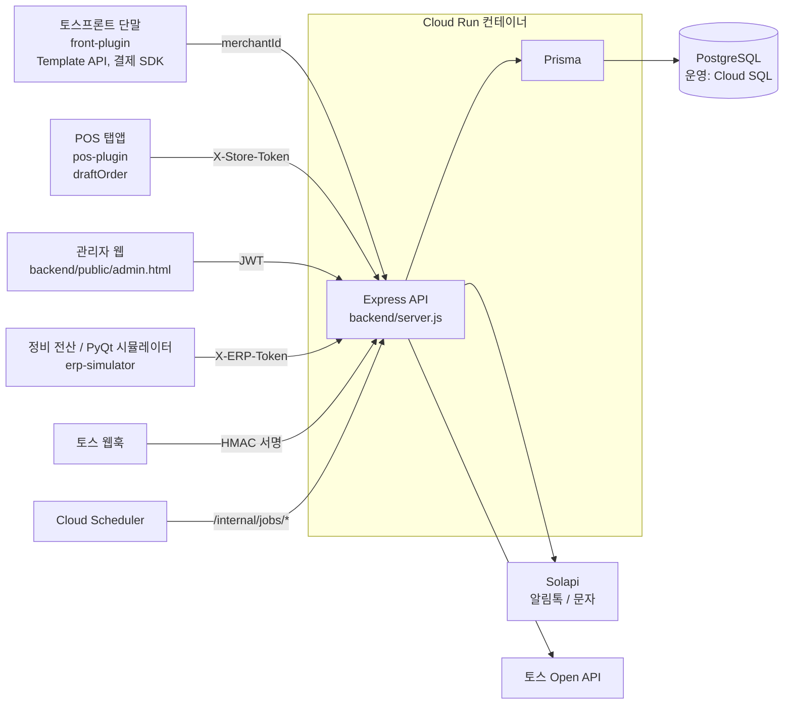
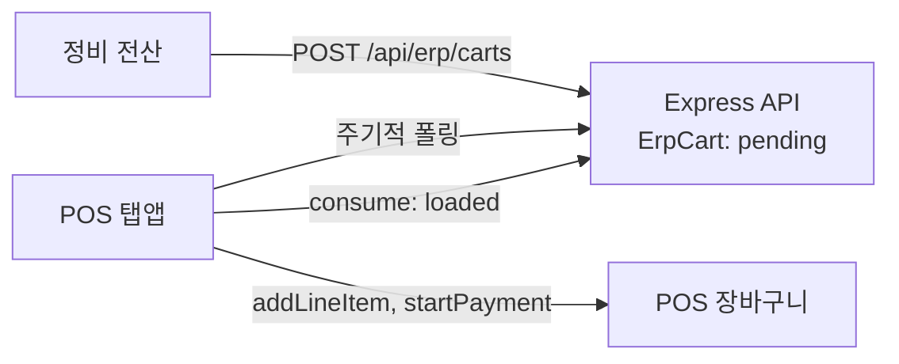
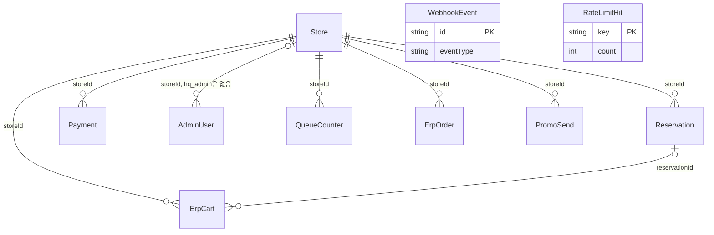

# car-service-queue — 정비 예약·대기열 플러그인

> 국내 완성차 브랜드 직영 정비센터 매장의 토스 결제 단말과 POS 안에서 동작하는 정비 예약, 대기 호출, 전자영수증·프로모션 알림톡 시스템. 정비 전산(ERP)–POS 장바구니 연동을 포함한다.

      

- **문제**: 정비센터 매장의 예약 접수, 대기 순서 호출, 결제 후 영수증·프로모션 안내를 매장의 결제 단말과 POS 안에서 처리하고, 정비 전산에 담은 품목까지 POS 결제로 넘겨야 했다.
- **해결**: 토스프론트 플러그인, POS 탭앱, 관리자 웹, 정비 전산 시뮬레이터가 Express 백엔드 하나를 공유하는 구조로 만들고, 매장 단위 격리와 중복 방지를 갖춘 멀티테넌트로 확장해 GCP Cloud Run에 올렸다.
- **내 역할**: 1인 프로젝트로 요구사항 정리, 설계, 구현, 테스트, 배포와 운영 대응을 전담했다.

## 프로젝트 개요

### 배경

정비센터 매장에는 손님이 쓰는 결제 단말(토스프론트)과 직원이 쓰는 POS(토스 POS)가 있고, 둘 다 토스플레이스 플러그인 SDK로 화면을 확장할 수 있다. 이 프로젝트는 그 안에서 예약 접수부터 대기 호출, 결제 후 안내까지 이어지는 흐름을 백엔드 하나로 묶는다.

- 첫 버전은 매장 1곳용 프로토타입이었다. 예약과 결제를 서버 메모리의 전역 배열에만 담았고, 관리자 인증도 토큰 하나를 모든 매장이 공유했다.
- 최대 500개 매장을 목표로 매장 단위로 데이터를 나누는 멀티테넌트 구조로 전환했다.
- 서비스 기반은 Render에서 GCP(Cloud Run, Cloud SQL, Cloud Scheduler)로 옮겼다.
- 제휴 목표(MOU)는 정비 전산에서 부품·공임을 담으면 토스 POS 장바구니에 그대로 들어가 직원이 결제만 하는 것이었고, 이를 위한 연동을 함께 구현했다.

| 구성 요소 | 위치 | 하는 일 |
|---|---|---|
| 토스프론트 플러그인 | [`front-plugin/`](front-plugin/README.md) | 손님이 결제 단말에서 차량번호, 정비 항목, 전화번호를 입력해 대기번호를 받고, 결제 뒤 영수증 알림톡을 받는다 |
| POS 탭앱 | [`pos-plugin/`](pos-plugin/README.md) | 직원이 POS 탭에서 대기열을 보고 호출, 정비완료, 취소를 처리하고 전산 장바구니를 POS에 담는다 |
| 관리자 웹 | [`backend/public/admin.html`](backend/public/admin.html) | 본사와 매장 관리자가 예약, 결제, 매장, 발송 실패 건을 관리한다 |
| 백엔드 | [`backend/`](backend/server.js) | Express API, 알림 발송, 웹훅, 배치 endpoint를 서버 하나가 맡는다 |
| 정비 전산 시뮬레이터 | [`erp-simulator/`](erp-simulator/README.md) | PyQt5 데스크톱 앱으로 전산 측 장바구니 전송을 재현한다 |

### 해결한 문제

- **매장 간 데이터 격리**: 예약, 결제, 채번 카운터를 모두 매장 ID로 나누고, 관리자는 본사(`hq_admin`)와 매장(`store_admin`) 2계층, POS 탭앱은 매장별 토큰으로 구분했다.
- **동시성과 중복**: 대기번호 채번, 알림 호출과 재발송, 웹훅 재전송이 겹쳐도 한 번만 처리되게 했다(핵심 기술 과제 1~3).
- **인스턴스 확장**: 서버 안 cron을 없애고 Cloud Scheduler가 내부 endpoint를 호출하게 했으며, 레이트리밋 저장소를 Postgres로 옮겼다(과제 4).
- **개인정보와 광고성 정보**: 수집 동의, `(광고)` 표기와 수신거부 문구, 보관기간이 지난 개인정보 파기 배치를 구현했다. 문구와 보관기간의 법무 검토는 남아 있다([privacy.md](docs/privacy.md)).
- **정비 전산–POS 결제 경로**: 토스 Open API로 만든 주문은 POS에서 결제할 수 없다는 것을 실단말기로 확인하고 POS 플러그인 SDK 장바구니 방식으로 바꿨다(과제 5).

## 팀 구성과 내 역할

| 항목 | 내용 |
|---|---|
| 기간 | 2026-07-16 ~ 2026-08-28 |
| 인원 | 1명 — 설계·구현·테스트·배포 전담 |
| 원본 커밋 | 95개 |
| 내 역할 | 요구사항 정리, 아키텍처와 DB 설계, 백엔드·토스프론트 플러그인·POS 탭앱·관리자 웹·정비 전산 시뮬레이터 구현, 테스트, Docker·Cloud Run 배포와 운영 대응 |

구현 과정에서 AI 코딩 도구(Claude, Codex)를 활용했다. 요구사항 정리, 설계 결정, 코드 리뷰, 실데이터 검증과 운영 대응은 직접 했다.

공개용으로 정리하면서 커밋 히스토리를 새로 시작했다. 원본 저장소 커밋 95개(2026-07-16 ~ 2026-08-28). 문서 속 커밋 해시는 원본 저장소 기준이다.

## 주요 기능

| 기능 | 동작 |
|---|---|
| 예약과 대기번호 | 차량번호, 정비 항목, 전화번호만 입력하면 매장·날짜별 대기번호를 발급하고 앞사람 수를 알림톡으로 안내한다 |
| 수동 순서 호출 | 접수만으로는 호출하지 않는다. 직원이 POS나 관리자 화면에서 호출할 때만 "순서입니다" 알림톡을 보낸다. POS 탭앱은 3초 안에 한 번 더 눌러야 요청이 나간다 |
| 정비완료 기반 대기열 | 알림 발송 여부가 아니라 직원이 처리하는 정비완료 상태로 앞사람 수를 센다 |
| 전자영수증 | 결제 뒤 전화번호로 같은 매장의 예약을 찾아 차량번호와 정비 항목을 채운 영수증 알림톡을 보낸다 |
| 3개월 후 프로모션 | 광고 수신에 동의한 손님만 대상이며 `(광고)` 표기와 수신거부 문구를 붙인다 |
| 발송 실패 처리 | 카카오 채널·템플릿이 없으면 일반 문자로 대신 보낸다. 발송이 실패한 건은 관리자가 실패 목록에서 재발송한다 |
| 관리자 웹 | 본사와 매장 2계층, 예약·결제 조회, 즉시 호출·정비완료·취소, 실패 재발송 |
| POS 탭앱 | 매장 토큰 인증, 전화번호 마스킹, 전날 미완 건 이월 표시 |
| 정비 전산 장바구니 → POS | 전산이 보낸 부품·공임을 POS 장바구니에 담고 결제를 시작한다 |
| 개인정보 파기 배치 | 보관기간이 지난 예약·결제 기록의 전화번호와 차량번호를 익명화한다 |
| 매장 대량 등록 | 매장을 한 번에 최대 500건 등록하고 항목별 성공·실패를 돌려준다 |

## 아키텍처



백엔드 하나가 API, 관리자 웹, 로컬 미리보기용 정적 파일(`front-plugin/`, `pos-plugin/dist/`)을 함께 서빙한다. 운영에서는 Docker 이미지로 Cloud Run에 올린다. 서버 안에는 스케줄러가 없고, 프로모션 발송과 개인정보 파기는 Cloud Scheduler가 `/internal/jobs/*`를 호출해 실행한다. 호출 주체마다 인증 방식이 다르다.

| 호출 주체 | 경로 | 인증 |
|---|---|---|
| 토스프론트 단말 | `/api/reservations`, `/api/payments` | 없음. `merchantId`로 매장을 식별하고 IP 레이트리밋을 건다 |
| POS 탭앱 | `/api/pos/*` | 매장별 64자리 hex 토큰(`X-Store-Token`) |
| 관리자 웹 | `/api/admin/*` 등 관리 API | JWT(`hq_admin`, `store_admin`) |
| 정비 전산 | `/api/erp/*` | 공유 토큰(`X-ERP-Token`) |
| Cloud Scheduler | `/internal/jobs/*` | 공유 토큰(`X-Promotion-Job-Token`) |
| 토스 웹훅 | `/api/webhooks/toss/payment` | HMAC 서명(`x-toss-signature`)과 타임스탬프 |

전체 경로 목록은 [docs/api.md](docs/api.md)에 있다.

## 기술 스택과 선택 이유

| 영역 | 선택 | 이유 |
|---|---|---|
| 백엔드 | Node.js 18, Express 4 | API, 관리자 웹, 로컬 미리보기용 정적 파일을 서버 하나가 함께 서빙한다 |
| DB | PostgreSQL 16, Prisma 5 | 매장-예약-결제가 관계형 데이터라 맞고, 채번과 레이트리밋에 `INSERT … ON CONFLICT`를 쓸 수 있다. Cloud Run은 인스턴스 로컬 디스크에 데이터를 둘 수 없어 SQLite에서 옮겼다 |
| 손님 화면 | 순수 HTML/JS(빌드 없음), 토스프론트 SDK | 심사가 Template API 사용을 요구하므로 화면을 `sdk.template.*`로만 구성했다. 폴더 자체가 배포 산출물이다 |
| POS 탭앱 | esbuild 번들, iframe 패키지 | `@tossplace/pos-plugin-sdk`가 npm 전용(ESM) 패키지라 브라우저에서 바로 쓸 수 없다. 프레임워크 없이 가장 단순한 구성으로 번들만 만든다 |
| 알림 | Solapi | 카카오 알림톡을 보내고, 채널·템플릿이 없으면 문자로 대신 보낸다. 호출마다 `SOLAPI_TIMEOUT_MS`로 시간 제한을 둔다 |
| 스케줄링 | Cloud Scheduler | 서버 안 cron을 없애 인스턴스가 늘어도 중복 실행되지 않는다. 재시도가 와도 claim과 `anonymizedAt` 조건으로 중복 처리를 막는다 |
| 인증 | bcryptjs, JWT | 관리자 이메일·비밀번호 로그인, 같은 계정 5회 연속 실패 시 15분 잠금 |
| 배포 | Docker, Cloud Run, Cloud SQL | 루트 [`Dockerfile`](Dockerfile)이 `npm ci`로 재현 가능하게 빌드한다 |
| 테스트 | node:test, supertest | 내장 러너를 쓰고, 로컬 `devdb`가 아니면 시작하지 않는 가드를 뒀다 |
| 전산 시뮬레이터 | Python, PyQt5 | 전산 측 연동을 시연·검증하는 데스크톱 앱이며, 실제 전산 벤더에게 호출 방법을 보여주는 참조 구현이기도 하다 |

## 핵심 기술 과제와 해결

### 1. 매장·날짜별 원자적 대기번호와 멱등 접수

- **문제**: 오늘 첫 두 손님이 거의 동시에 접수하면 두 트랜잭션이 모두 카운터가 없다고 보고 새로 만들다 `(storeId, date)` unique 제약(P2002)에 걸려 500이 나갔다. READ COMMITTED에서는 트랜잭션 안의 `SELECT`가 동시 실행을 막지 않는다. 네트워크가 끊겼다 재시도된 요청이 예약을 두 번 만드는 문제도 있었다.
- **해결**: 채번을 `INSERT … ON CONFLICT ("storeId","date") DO UPDATE SET counter = counter + 1 RETURNING counter` 한 문장으로 바꿔 행 잠금으로 직렬화했다. 프론트 플러그인이 접수 시도마다 `Idempotency-Key`를 실어 보내고, 서버는 이 키를 unique 컬럼에 저장한다. 같은 키의 재요청은 기존 예약을 돌려주고, 다른 매장의 키와 충돌하면 오류로 막으며, 동시에 들어온 같은 키는 P2002를 잡아 이미 만든 예약을 반환한다.
- **근거 코드**: [`backend/src/store.js`](backend/src/store.js#L398)의 `createReservation`, [`backend/prisma/schema.prisma`](backend/prisma/schema.prisma)의 `QueueCounter`
- **검증/결과**: `api.test.js`의 "같은 매장에 동시에 여러 예약이 접수돼도 대기번호가 충돌하지 않는다"가 5건을 동시에 접수해 대기번호 1~5를 확인한다. 재시도 중복은 원본 커밋 `5041051`에서 프론트 플러그인이 같은 키를 재사용하도록 고쳤다.

### 2. 호출과 재발송 중복 방지

- **문제**: POS의 2단계 탭만으로는 API 중복 요청을 막을 수 없다. 같은 예약에 요청이 겹치면 순서 알림이 두 번 나가고, 관리자 두 명이 거의 동시에 재발송을 눌러도 마찬가지다.
- **해결**: 상태 전이를 기대 상태를 조건으로 건 `updateMany`로 바꿨다. `waiting → called`와 `notify_failed → called`는 조건을 통과한 한 요청만 알림을 보낸다. POS의 전산 장바구니 소비도 `updateMany({ where: { id, status: 'pending' } })`의 반환 count로 처리 여부를 판별한다.
- **근거 코드**: [`backend/src/store.js`](backend/src/store.js#L585)의 `markReservationCalled`, [`backend/src/store.js`](backend/src/store.js#L602)의 `markReservationCalledFromNotifyFailed`
- **검증/결과**: `api.test.js`의 재발송 성공·재실패 테스트와 `erpCart.test.js`의 "consume 두 번: 두 번째 호출은 alreadyProcessed:true를 반환한다"로 재시도 경로를 검증했다. 동시 호출 부하 테스트는 하지 못했다.

### 3. 토스 웹훅 처리 순서

- **문제**: 웹훅은 결제 단말의 직접 호출이 유실될 때를 대비한 백업 경로다. 토스가 같은 이벤트를 재전송할 수 있고, Cloud Run은 응답을 보낸 뒤 인스턴스 CPU를 스로틀링해서 본 처리를 응답 뒤로 미루면 결제 반영이 중간에 멈춰 유실될 수 있었다.
- **해결**: `x-toss-timestamp`가 5분 안인지 확인하고 `HMAC-SHA256(secret, "{timestamp}.{rawBody}")`의 `v1=` 서명을 상수 시간 비교로 검증한다. 통과하면 본 처리 전에 이벤트 ID(`x-toss-webhook-id`)를 먼저 기록해 재전송을 걸러낸다. 본 처리는 응답 전에 끝내고, 실패하면 기록을 지운 뒤 500을 반환해 토스가 재시도하게 한다. 운영(`NODE_ENV=production`)에서 시크릿이 없으면 서버가 부팅하지 않는다.
- **근거 코드**: [`backend/server.js`](backend/server.js#L1648)의 서명 계산, [`backend/server.js`](backend/server.js#L1663)의 이벤트 기록
- **검증/결과**: `api.test.js`의 "웹훅 처리 중 예외가 발생하면 500을 반환하고 WebhookEvent 기록을 되돌려 재시도가 가능하게 한다"와 "승인 웹훅은 … 중복은 건너뛴다"로 확인했다. 웹훅 payload에 `paymentKey`가 없어 결제 건과 잇는 필드를 확정하지 못한 점은 남은 과제다.

### 4. 다중 인스턴스에서도 유지되는 레이트리밋

- **문제**: `express-rate-limit`의 기본 저장소는 프로세스 메모리라, Cloud Run 인스턴스가 늘면 한도가 인스턴스마다 따로 적용된다.
- **해결**: Postgres upsert 고정 윈도 스토어(`RateLimitHit` 테이블)로 한도를 인스턴스 사이에 공유한다. 5초마다 폴링하는 `GET /api/pos/queue`만은 토큰 인증이 붙어 있고 폴링마다 DB 왕복을 늘릴 이유가 없어서 메모리 리미터로 분리했다.
- **근거 코드**: [`backend/src/rateLimitStore.js`](backend/src/rateLimitStore.js), `backend/server.js`의 [로그인 한도](backend/server.js#L373), [예약 한도](backend/server.js#L499), [POS 폴링 한도](backend/server.js#L877)
- **검증/결과**: `api.test.js`의 "관리자 로그인은 짧은 시간 안에 설정된 limit을 초과하면 429를 반환한다", "같은 전화번호로 영수증 요청이 한도를 넘으면 429를 반환한다"와 `erpCart.test.js`의 폴링·전산 한도 테스트로 확인했다. 실제 여러 인스턴스에서의 부하 검증은 하지 못했다.

### 5. 정비 전산–POS 연동 경로 전환

- **문제**: 토스 공개 문서와 실제 동작이 달랐다. `payments: []`가 필수이고 `chargePrice`는 숫자가 아니라 객체였으며 `diningOption` 허용값은 문서에 없었다. 더 큰 문제는 Open API로 만든 주문이 POS [현황] 탭에는 뜨지만 결제 진입점이 없다는 점이었다. 결제건이 외부결제수단으로 처리되기 때문이다.
- **해결**: 실호출로 스펙을 하나씩 확정한 뒤, 결제 진입점이 있는 POS 플러그인 SDK `draftOrder` 장바구니 방식으로 경로를 바꿨다. 전산이 `POST /api/erp/carts`로 장바구니를 보내면 서버가 우편함 역할을 하고, POS 탭앱이 이를 받아 `addLineItem`으로 POS 장바구니에 직접 담는다. 기존 Open API 경로(`/api/erp/draft-orders`)는 지우지 않고 남겼다.
- **근거 코드**: [`backend/src/tossOrderClient.js`](backend/src/tossOrderClient.js#L36)의 `buildChargePrice`, [`#L57`](backend/src/tossOrderClient.js#L57)의 `createTossDraftOrder`, [`backend/server.js`](backend/server.js#L1847)의 `draft-orders`, [`#L2277`](backend/server.js#L2277)의 `carts`, [`pos-plugin/src/erpCarts.js`](pos-plugin/src/erpCarts.js), [조사 결과](docs/ERP연동-결제경로-조사결과.md), [장바구니 연동 설계](docs/전산-POS-장바구니-연동설계.md)
- **검증/결과**: 카탈로그에 없는 임의 품목이 실단말기의 POS [주문] 탭에 담기고 결제 버튼이 활성화되는 것을 확인했다(2026-08-26). `erpOrder.test.js`(23건)가 Open API 경로를, `erpCart.test.js`(135건)가 장바구니 경로와 POS 쪽 기능을 검증한다. 이후 결제 화면으로 넘어가기 전에 담기 결과를 먼저 보고하도록 순서를 고쳤고(`07ffa95`), 단말기 2대에서 같은 주문이 두 번 결제되는 문제(`f16a3f0`)도 고쳤다.



## 데이터 모델 요약



| 모델 | 역할 | 핵심 제약 |
|---|---|---|
| `Store` | 매장 | `merchantId`, `posToken`, `erpStoreCode` 각각 unique |
| `Reservation` | 예약과 대기 | `idempotencyKey` unique, `(storeId, serviceDate, status)` 인덱스, 파기 시각 `anonymizedAt` |
| `Payment` | 결제와 영수증 | `paymentKey` unique, 프로모션 대상 판정용 `promoAt`·`promoSent` |
| `QueueCounter` | 매장·날짜별 채번 | `(storeId, date)` unique |
| `AdminUser` | 관리자 계정 | `email` unique, 5회 실패 잠금용 `failedLoginCount`·`lockedUntil` |
| `ErpOrder` | Open API 주문 중개 기록 | `referenceId`, `tossOrderKey` unique |
| `ErpCart` | 전산 장바구니 우편함 | `referenceId` unique, 예약과 확실할 때만 연결 |
| `PromoSend` | 수동 홍보 발송 기록 | 보관기간 뒤 전화번호 삭제 |
| `WebhookEvent` | 웹훅 중복 수신 방지 | 토스 웹훅 ID를 기본키로 사용 |
| `RateLimitHit` | 레이트리밋 카운터 | 키별 고정 윈도 |

상태값은 다음과 같다.

- 예약: `waiting`, `called`, `notify_failed`, `completed`, `cancelled`
- 결제: `requested`, `receipt_sent`, `receipt_failed`, `cancelled`
- 전산 장바구니: `pending`, `loaded`, `failed`, `dismissed`, `expired`, `cancelled`, `paid`

## 실행 방법

필요한 것은 Node.js 18 이상과 Postgres 컨테이너를 띄울 Docker다. 로컬 DB도 SQLite가 아니라 PostgreSQL이다.

```bash
git clone https://github.com/pyobonboy/car-service-queue.git
cd car-service-queue/backend
npm install

# 로컬 Postgres 컨테이너. 최초 1회만 만들고, 이후에는 docker start queue-test-pg로 재사용한다
docker run --name queue-test-pg -e POSTGRES_PASSWORD=devpass -e POSTGRES_DB=devdb -p 5432:5432 -d postgres:16-alpine

cp .env.example .env        # DATABASE_URL 기본값이 위 컨테이너와 맞는다. 나머지는 비워도 서버는 뜬다
npx prisma migrate deploy   # devdb에 스키마 생성
npm start
```

환경변수는 [`backend/.env.example`](backend/.env.example)에 변수별 설명이 있다. Solapi 키가 비어 있으면 알림 발송만 실패하고 예약·결제 접수는 정상 처리된다. 최초 부팅 때 `hq_admin` 계정이 없으면 자동으로 만들어지며, 부트스트랩 값을 비워 두면 코드 기본값 이메일과 무작위 비밀번호가 콘솔에 한 번 출력된다. 로컬에서는 `merchantId '0'` 테스트 매장이 자동으로 시드된다.

| 접속 주소 | 내용 |
|---|---|
| `http://localhost:3000` | 독립 웹페이지 — 차량번호와 전화번호 예약 폼 |
| `http://localhost:3000/?mode=payment` | 독립 웹페이지 — 결제(영수증) 모드 |
| `http://localhost:3000/toss-plugin/index.html` | 토스프론트 플러그인 화면을 브라우저에서 미리보기 |
| `http://localhost:3000/admin.html` | 관리자 대시보드 |

플러그인 배포는 각 폴더의 ZIP 스크립트(`package.ps1`, `package.sh`)로 만든 파일을 토스플레이스 개발자센터에 올린다. API 주소는 빌드 시점에 번들에 굽고, 주소가 없으면 빌드가 멈춘다. 절차와 겪은 함정은 [배포-패키징-가이드](docs/배포-패키징-가이드.md), 폴더별 명령은 [front-plugin/README.md](front-plugin/README.md)와 [pos-plugin/README.md](pos-plugin/README.md)에 있다. POS 탭앱의 로컬 미리보기와 토큰 준비는 [pos-plugin/README.md](pos-plugin/README.md#로컬-미리보기)를 본다.

## 테스트

```bash
cd backend
npm test
```

`node --test`와 supertest를 쓰고, 로컬 PostgreSQL의 `devdb`가 떠 있어야 한다. 테스트 파일은 접속 대상이 `localhost`, `127.0.0.1`, `::1`의 `devdb`가 아니거나 `NODE_ENV=production`이면 시작 단계에서 실패하므로 운영 DB를 건드릴 수 없다. 준비 절차는 [`backend/TESTING.md`](backend/TESTING.md)에 있다.

| 파일 | 케이스 | 주요 내용 |
|---|---|---|
| [`api.test.js`](backend/test/api.test.js) | 41 | 로그인 한도와 계정 잠금, 웹훅, 매장 격리, 개인정보 동의, 결제, 재발송, 동시 접수 |
| [`erpCart.test.js`](backend/test/erpCart.test.js) | 135 | 장바구니 멱등·소비·취소·만료, 매장 격리, 폴링·전산 한도, 개인정보 파기, 정비 이력·홍보 |
| [`erpOrder.test.js`](backend/test/erpOrder.test.js) | 23 | Open API 주문 생성(목 서버), 입력 검증, 멱등·재시도, 매장코드 등록 |
| [`solapi.test.js`](backend/test/solapi.test.js) | 4 | 발송 시간 제한 |

[`.github/workflows/backend-tests.yml`](.github/workflows/backend-tests.yml)에 잡 3개(`test`, `syntax-check`, `pos-plugin-build`)가 있고 push와 pull request마다 돈다.

## 폴더 구조

```text
car-service-queue/
├─ backend/                  # 공유 서버. front-plugin, pos-plugin/dist를 로컬 미리보기용으로 정적 서빙
│  ├─ server.js              # 라우트, 인증·레이트리밋, 웹훅, /internal/jobs/*
│  ├─ src/
│  │  ├─ store.js            # 데이터 계층(Prisma)
│  │  ├─ rateLimitStore.js   # Postgres 레이트리밋 저장소
│  │  ├─ tossOrderClient.js  # 토스 Open API 주문 생성
│  │  ├─ solapi.js           # 알림톡·문자 발송
│  │  └─ auth.js, logger.js, securityHeaders.js
│  ├─ prisma/                # schema.prisma, migrations/
│  ├─ public/                # 독립 웹페이지, admin.html(관리자 웹)
│  ├─ scripts/               # 토스 Open API 실호출 검증 등 보조 스크립트
│  └─ test/                  # node:test + supertest
├─ front-plugin/             # 토스프론트 플러그인(빌드 없음, ZIP 스크립트 포함)
├─ pos-plugin/               # 토스 POS 탭앱(esbuild)
│  └─ src/                   # app.js, erpCarts.js, lineItem.js, history.js, nav.js, crashGuard.js
├─ erp-simulator/            # 정비 전산 시뮬레이터(PyQt5)
├─ docs/                     # 설계·운영 문서
├─ .github/workflows/        # CI
└─ Dockerfile, docker-entrypoint.sh   # Cloud Run 배포용 이미지
```

### 관련 문서

- [docs/api.md](docs/api.md): API 목록, Cloud Scheduler 잡 등록 절차, POS 토큰 운영 절차
- [docs/erp-integration.md](docs/erp-integration.md): Open API 주문 생성 방식(1차 구현)과 토스 확인 사항
- [docs/privacy.md](docs/privacy.md): 동의 수집, 광고 문구, 보관기간과 파기
- [docs/전산-POS-장바구니-연동설계.md](docs/전산-POS-장바구니-연동설계.md), [docs/ERP연동-결제경로-조사결과.md](docs/ERP연동-결제경로-조사결과.md): 현재 주 경로의 설계와 전환 경위
- [docs/배포-패키징-가이드.md](docs/배포-패키징-가이드.md), [docs/롤백-절차.md](docs/롤백-절차.md), [docs/현재-운영-프로세스-가이드.md](docs/현재-운영-프로세스-가이드.md): 배포, 롤백, 운영
- [docs/gcp-migration-and-scale-plan.md](docs/gcp-migration-and-scale-plan.md), [docs/multi-store-architecture-review.md](docs/multi-store-architecture-review.md): GCP 이전 계획, 멀티 매장 아키텍처 검토
- [계획](docs/01-plan/features/multi-store-support.plan.md), [설계](docs/02-design/features/multi-store-support.design.md): 멀티 매장 전환 문서
- 하위 README: [front-plugin](front-plugin/README.md), [pos-plugin](pos-plugin/README.md), [erp-simulator](erp-simulator/README.md)

## 회고와 개선 과제

**배운 점**

- 공식 문서를 그대로 믿지 않고 실호출과 실단말기로 확인해야 한다. 토스 Open API는 `payments` 필수와 `chargePrice` 객체 등, POS SDK는 `key`가 자동 생성되지 않는 점 등 문서와 다른 동작이 여러 개였다([설계 문서](docs/전산-POS-장바구니-연동설계.md) 5절).
- 초기 구현의 주석을 확인 없이 믿었다가, 존재하지 않는 SDK API(`sdk.merchant`)를 쓰고 있던 것을 공식 문서 대조로 찾아 `sdk.app.getMerchant()`로 고쳤다([검토 문서](docs/multi-store-architecture-review.md) 0절).
- Open API 방식을 구현한 뒤 실단말기에서 결제할 수 없다는 것을 확인했고, 같은 날(2026-08-26) POS 장바구니 방식으로 전환했다. 기존 경로는 지우지 않고 남겨 뒀다.

**남은 과제**

| 과제 | 현재 상태 |
|---|---|
| 개인정보·광고 문구, 보관기간 법무 검토 | 미완. 기능은 구현했지만 문구와 `DATA_RETENTION_DAYS`(기본 1095일)는 검토 전이다 |
| 부하 테스트 | 미실시. Cloud Run 동시성, 최대 인스턴스, DB 커넥션 풀(`connection_limit`) 값을 정하지 못했다 |
| 부팅 시 마이그레이션 분리 | `RUN_MIGRATIONS_ON_BOOT` 기본값이 `true`라 동시 콜드스타트에서 잠금 경합 위험이 있다. `false`로 바꾸고 Cloud Run Job 등으로 분리해야 한다 |
| 웹훅의 `paymentKey` 대응 | payload에 `paymentKey` 필드가 없어 `orderId`와 같다고 가정했다. 실결제로 확인하지 못했다 |
| 전산 결제완료 회신(2단계) | 서버가 전산에 먼저 알리는 콜백은 미구현이다. POS가 결제 완료를 보고하면 전산이 조회로 확인하는 방식만 가능하다 |
